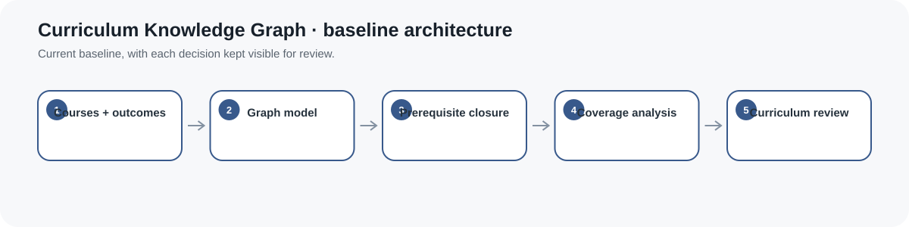
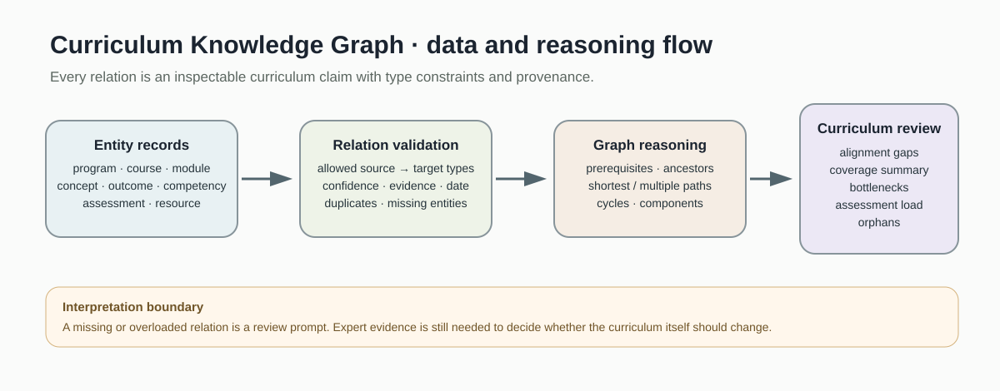
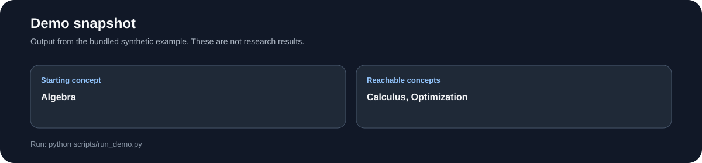
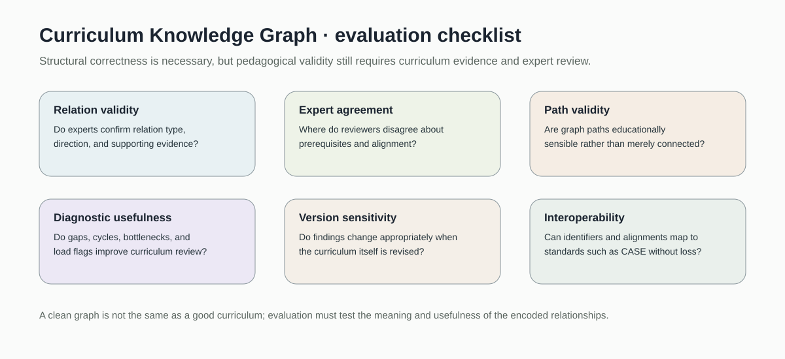

# Curriculum Knowledge Graph

> Typed, provenance-aware curriculum knowledge graph for prerequisite reasoning, curriculum alignment diagnostics, path analysis, and expert review.

[](https://github.com/devissaputra/curriculum_knowledge_graph/actions/workflows/ci.yml)



**Area:** AI in Education · Instructional Design · Curriculum Intelligence  
**Status:** working research prototype  
**Author:** Devis Wawan Saputra

## Why this project exists

Curricula contain many relationships that are difficult to inspect in spreadsheets or prose:

- which concepts depend on which prerequisites
- which courses teach which concepts
- which outcomes are actually assessed
- which outcomes align with program competencies
- which learning resources support particular concepts
- where curriculum paths contain cycles or bottlenecks
- where important entities are structurally disconnected

This repository represents those relationships as a typed semantic graph.

The graph is designed to support **curriculum review**, not to replace curriculum experts.

## What makes this a knowledge graph

The original prototype stored only concept strings and prerequisite edges.

The current implementation represents multiple kinds of curriculum entities and validates the semantics of relationships between them.

### Entity types

- Program
- Course
- Module
- Concept
- LearningOutcome
- Competency
- Assessment
- Resource

### Relation types

- `PART_OF`
- `TEACHES`
- `HAS_OUTCOME`
- `ASSESSES`
- `ALIGNS_WITH`
- `PREREQUISITE_OF`
- `SUPPORTS`



Relation semantics are constrained.

For example:

```text
Course          ──TEACHES─────────→ Concept
Course          ──HAS_OUTCOME─────→ LearningOutcome
Assessment      ──ASSESSES────────→ LearningOutcome
LearningOutcome ──ALIGNS_WITH─────→ Competency
Concept         ──PREREQUISITE_OF─→ Concept
Resource        ──SUPPORTS────────→ Concept / LearningOutcome
Course          ──PART_OF─────────→ Program
```

An invalid relationship such as:

```text
LearningOutcome ──TEACHES→ Course
```

is rejected.

## Stable entities

Each graph entity has:

- stable id
- entity type
- human-readable label
- optional description
- metadata

Stable identifiers are important because curriculum labels may change while references between systems still need to remain durable.

## Provenance-aware relations

A curriculum relation is a claim.

Each relation can therefore include:

- confidence
- source type
- evidence note
- review date

Example:

```text
concept.statistics
    ──PREREQUISITE_OF──>
concept.learning_analytics

confidence: 0.85
source_type: expert_review
evidence: Synthetic alternative path
reviewed_on: 2026-09-24
```

These provenance fields make the graph inspectable.

They do not prove that a curriculum relation is correct.

## Prerequisite reasoning

The graph supports:

- direct prerequisites
- direct dependents
- prerequisite ancestors
- prerequisite descendants
- shortest prerequisite path
- multiple simple prerequisite paths
- cycle detection
- topological sequencing when the prerequisite graph is acyclic

### Cycle handling

Traversal remains cycle safe, but cycles are now reported explicitly.

For a prerequisite model:

```text
A → B → C → A
```

is not silently treated as a valid curriculum sequence.

`detect_prerequisite_cycles()` returns the cycle for expert review.

`topological_order()` refuses to produce a sequence while a cycle remains.

## Curriculum alignment diagnostics

`alignment_gaps()` identifies structural review cases such as:

- learning outcomes with no assessment relation
- concepts with no teaching relation
- competencies with no aligned learning outcome
- courses with no declared learning outcome

These are **review prompts**, not automatic declarations that a curriculum is defective.

Missing relations may reflect missing documentation rather than missing curriculum activity.

## Structural coverage

`coverage_summary()` reports structural coverage for:

- assessed learning outcomes
- taught concepts
- aligned competencies
- courses with outcomes

A structural coverage value is not a curriculum-quality score.

For example, 100% outcome-to-assessment coverage does not establish that the assessments validly measure those outcomes.

## Bottlenecks and assessment load

The graph can inspect:

- prerequisite degree
- highly connected prerequisite concepts
- number of learning outcomes/competencies attached to each assessment
- assessments above a configurable target-count threshold

A graph bottleneck is not automatically the most educationally important concept.

Likewise, a highly connected capstone may be intentionally integrative rather than poorly designed.

## Connected components and orphans

`connected_components()` identifies weakly connected graph regions.

`orphans()` finds entities with no incoming or outgoing relation.

Orphans can indicate:

- missing curriculum documentation
- deprecated entities
- a true curriculum gap
- an intentionally independent concept

Human interpretation is required.

## Import and export

The repository supports:

- `CurriculumGraph.from_csv(...)`
- `CurriculumGraph.from_records(...)`
- `CurriculumGraph.from_json(...)`
- `graph.to_dict()`
- `graph.to_json(...)`

Import validation checks:

- entity types
- relation types
- source/target semantic compatibility
- duplicate entity ids
- duplicate relations
- dangling relation references
- confidence bounds
- review-date format

## Synthetic demonstration



The bundled synthetic graph contains:

- 1 program
- 6 courses
- 2 modules
- 18 concepts
- 12 learning outcomes
- 5 competencies
- 6 assessments
- 8 resources
- more than 100 typed curriculum relations

It deliberately includes:

- one prerequisite cycle
- one orphan concept
- one learning outcome with no assessment
- one competency with no outcome alignment
- one overloaded capstone assessment
- several prerequisite bottlenecks
- multiple paths to later AIED concepts

The demo is designed to **discover** these conditions.

They are test fixtures, not research results.

## Demo output

The demo reports:

- graph size by entity type
- prerequisite cycles
- direct prerequisites
- prerequisite ancestors
- shortest path
- alternative paths
- orphans
- bottlenecks
- overloaded assessments
- alignment gaps
- coverage summary
- topological-sequence failure on the cyclic graph
- a valid topological order after the deliberately marked cycle edges are removed

## Run the project

```bash
git clone https://github.com/devissaputra/curriculum_knowledge_graph.git
cd curriculum_knowledge_graph

python scripts/run_demo.py
python -m unittest discover -s tests -v
```

The current implementation uses only the Python standard library.

## Data

`data/entities.csv`  
Typed synthetic curriculum entities.

`data/relations.csv`  
Typed graph relations with confidence, provenance, evidence, and review dates.

`data/sample.csv`  
Small relation sample for quick inspection.

`data/README.md`  
Schema, provenance, interoperability context, and real-data governance guidance.

## Core API

`add_entity(...)`  
Registers a typed curriculum entity.

`add_relation(...)`  
Adds a semantically validated typed relation with provenance.

`add_concept(...)` / `add_prerequisite(...)`  
Backward-compatible helpers for concept graphs.

`direct_prerequisites(...)`  
Returns immediate prerequisite concepts.

`direct_dependents(...)`  
Returns concepts that directly depend on the selected concept.

`ancestors(...)` / `descendants(...)`  
Returns transitive prerequisite relationships.

`shortest_path(...)`  
Returns the shortest relation path between two entities.

`all_paths(...)`  
Returns multiple simple paths up to a configurable limit.

`detect_prerequisite_cycles(...)`  
Finds prerequisite cycles.

`topological_order(...)`  
Returns a prerequisite-respecting concept order when the graph is acyclic.

`connected_components(...)`  
Returns weakly connected graph components.

`orphans(...)`  
Returns disconnected entities.

`bottlenecks(...)`  
Reports high-degree entities for a selected relation.

`assessment_loads(...)` / `overloaded_assessments(...)`  
Reviews assessment relation load.

`alignment_gaps(...)`  
Finds structural curriculum alignment gaps.

`coverage_summary(...)`  
Summarizes structural alignment coverage.

`validate_graph(...)`  
Returns major graph diagnostics in one record.

## Standards context

The repository is informed by 1EdTech CASE, which provides a standardized way to exchange competencies, academic standards, learning outcomes, and associations across educational systems.

This repository is **not CASE conformant**.

It does not implement the complete CASE information model, API, JSON-LD binding, rubric model, or conformance requirements.

The current graph instead provides a small transparent semantic baseline whose stable identifiers and explicit alignments make later interoperability work easier to study.

See `docs/related_work.md`.

## Research context

The related-work review also covers research on:

- concept prerequisite relationships in knowledge graphs
- educational-resource knowledge graphs
- knowledge-graph construction and reasoning challenges

The current repository does **not** implement:

- automatic entity extraction
- automatic entity linking
- learned prerequisite discovery
- RDF/OWL
- SPARQL
- graph embeddings
- graph neural networks
- learner mastery estimation
- personalized learning-path recommendation

That boundary is deliberate.

## Evaluation checklist



A real curriculum study should investigate:

1. **Relation validity** — do experts agree that each relation exists and points in the right direction?
2. **Expert agreement** — which curriculum claims are disputed?
3. **Path validity** — are graph paths pedagogically sensible?
4. **Diagnostic usefulness** — do cycles, gaps, bottlenecks, and load flags improve curriculum review?
5. **Version sensitivity** — do diagnostics change appropriately when the curriculum changes?
6. **Interoperability** — can graph identifiers and alignments map to an external standard without losing meaning?

## Responsible use

Graph structure is not curriculum truth.

A prerequisite edge can be wrong.

A missing assessment link can be missing documentation.

A highly connected concept is not automatically the most important concept.

A graph path is not automatically the best learning path for every learner.

The prototype should not be used alone for:

- automated accreditation decisions
- automated learner sequencing
- admissions
- grading
- restricting course access
- deciding learner mastery
- ranking instructors
- declaring standards compliance

See `docs/ethics_and_risks.md`.

## Limitations

The current baseline:

- uses a small curated relation vocabulary
- does not distinguish required/recommended/co-requisite edges
- does not implement curriculum versioning internally
- stores confidence but does not estimate it
- does not calculate inter-rater agreement
- does not infer missing graph relations
- does not extract entities automatically
- does not model learner state
- does not prove pedagogical validity
- does not implement formal semantic-web reasoning

Its purpose is transparent curriculum representation and review.

## Repository map

```text
.
├── .github/workflows/ci.yml
├── assets/
│   ├── architecture.svg
│   ├── data_flow.svg
│   ├── demo_snapshot.svg
│   └── evaluation_dashboard.svg
├── data/
│   ├── README.md
│   ├── entities.csv
│   ├── relations.csv
│   └── sample.csv
├── docs/
│   ├── ethics_and_risks.md
│   ├── related_work.md
│   └── research_protocol.md
├── reports/model_card.md
├── scripts/run_demo.py
├── src/curriculum_knowledge_graph/
│   ├── __init__.py
│   └── core.py
├── tests/test_core.py
├── .gitignore
├── CITATION.cff
├── LICENSE
├── pyproject.toml
├── requirements.txt
└── README.md
```

## Research path

A stronger empirical version would:

1. encode a real curriculum with explicit versioning
2. define concept-granularity rules before graph construction
3. have multiple subject experts independently review relation samples
4. measure agreement and adjudicate disputed edges
5. distinguish required, recommended, and co-requisite relationships
6. validate alignment gaps against curriculum documents and actual assessment tasks
7. test whether path and bottleneck diagnostics improve curriculum-review decisions
8. map selected competency/outcome structures to 1EdTech CASE
9. evaluate change detection across curriculum revisions
10. only then investigate automated relation extraction or graph-assisted recommendation

## Citation and license

`CITATION.cff` contains the software citation.

Code and original SVG visuals use the MIT License. External standards, competency frameworks, and curriculum documents retain their own licenses and usage conditions.
